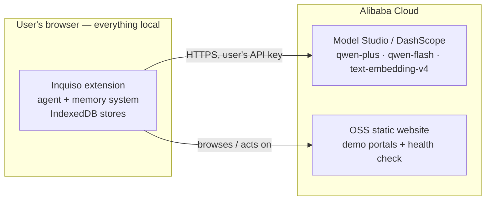

# Alibaba Cloud Deployment

Inquiso is **serverless by design** (CLAUDE.md hard rule 5): there is no Inquiso backend, and
memory never leaves the browser. The Alibaba Cloud footprint therefore has two parts:

1. **Qwen Cloud (Model Studio / DashScope)** — the AI backend. The extension calls it
   directly, BYOK, from the background worker: chat + tool-calling (`qwen3-max` / `qwen-plus`),
   background memory extraction (`qwen-flash`), and memory embeddings (`text-embedding-v4`).
2. **OSS static website hosting** — serves the controlled demo portals (`demo/portals`) so
   the demo does not depend on external websites.



## 1. Qwen Cloud (DashScope) setup

1. Create an API key in [Alibaba Cloud Model Studio](https://bailian.console.alibabacloud.com/?apiKey=1).
2. In Inquiso: **Settings → Models → Qwen (DashScope)** → paste the key, pick `qwen-plus`
   (or `qwen3-max` for the strongest planner).
3. That's it — the provider def (`src/core/providers/defs/qwen.ts`) uses the international
   OpenAI-compatible endpoint `https://dashscope-intl.aliyuncs.com/compatible-mode/v1` and
   automatically routes background extraction to `qwen-flash` and embeddings to
   `text-embedding-v4`.

The key is stored AES-GCM-encrypted in the background worker only (docs/05). If your network
requires the China-region endpoint, add a custom provider with
`https://dashscope.aliyuncs.com/compatible-mode/v1` (Settings → Models → Add provider), which
also walks you through the per-origin host permission grant.

## 2. Demo portals on OSS

Prerequisites: an Alibaba Cloud account and
[ossutil](https://www.alibabacloud.com/help/en/oss/developer-reference/ossutil) configured
(`ossutil config` — keys live in your local ossutil profile, never in this repo).

```bash
export OSS_BUCKET=inquiso-demo        # your bucket name
export OSS_REGION=eu-central-1        # any OSS region
./deploy/alibaba/deploy.sh
```

The script is repeatable (idempotent): it creates the bucket if missing, enables static
website hosting (`deploy/alibaba/website.xml`), uploads a `health.json` with the deploy
timestamp (the health check), and syncs `demo/portals/` with `--delete`.

Deployed URLs (also printed by the script):

| What | URL |
| --- | --- |
| Demo hub (version switch) | `https://<bucket>.oss-website-<region>.aliyuncs.com/` |
| Invoice portal | `…/invoice/` |
| Expense portal | `…/expense/` |
| Health check | `…/health.json` |

### Proof points for the submission

- `health.json` timestamp shows a live deployment.
- The OSS console shows the bucket + static-website configuration.
- The extension's Qwen provider screen shows DashScope as the active backend, and each run's
  token/step usage (visible per turn) comes from Qwen responses.

## Environment variables

| Variable | Used by | Meaning |
| --- | --- | --- |
| `OSS_BUCKET` | `deploy/alibaba/deploy.sh` | Target bucket (required) |
| `OSS_REGION` | `deploy/alibaba/deploy.sh` | OSS region id (default `eu-central-1`) |
| DashScope API key | extension UI (never env/repo) | entered in Settings → Models, encrypted at rest |

No secrets are committed anywhere in this repository.

## Alternatives considered

Function Compute / ECS would only add moving parts: the portals are fully static and the
extension must not have a backend, so OSS static hosting is the simplest reliable option.
If a custom domain + HTTPS is wanted for the demo, front the bucket with CDN (standard OSS
setup) — not required for the demo.
