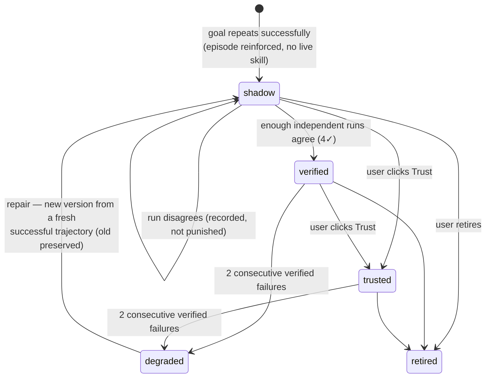

# Browser Skills (Procedural Memory)

The flagship capability: verified browser workflows become learned, versioned, executable
procedures — data, not code (`src/core/memory/skills/`, schema in `src/shared/memory/skill.ts`).

## Skill lifecycle

## Learning (candidate generation)

The dedupe pipeline doubles as the repeat detector: when a run's episode comes back
**reinforced** (a similar episode already existed → this goal has now verifiably succeeded
more than once) and no live skill matches the goal on that origin, the run's trajectory is
normalized into a skill in `shadow` (`skills/candidates.ts`, `skills/lifecycle.ts`). One
uncertain run never auto-promotes; failed runs reinforce nothing.

## Trajectory normalization

`skills/normalize.ts` turns *verified* ledger events into semantic steps:

- Only `OutcomeVerified: verified_success` actions qualify; the verdict scan is bounded by
  action boundaries so a failed action can never borrow its successor's verdict.
- Elements become layered locators — role + accessible name first, visible text, then CSS
  only as explicit fallback (`shared/memory/locator.ts`); the accessible name/role are
  captured at action time from the verifier's before-snapshot (passwords excluded at the
  content-script source).
- **Typed values are always `{{parameters}}`** — the ledger never stored them (they may be
  sensitive), so a workflow's variable data (report name, month, recipient) must come fresh
  each run. Stable structure is learned; user data is not.
- Preconditions (origin, required inputs) and success criteria (observed evidence kinds) are
  derived from the same events.

## Shadow testing

A shadow skill is **advisory**: it is rendered in the memory block as steps the planner may
follow, gains no permissions, and cannot be executed by `runSkill`. After a matching run
completes, `skills/shadow.ts` checks whether the skill's steps appear in order inside the
run's actual verified trajectory: agreement records a success (promotion path), disagreement
is logged with mismatches but not punished — the planner may simply have found another valid
path.

## Execution

`runSkill` (an agent tool) executes only `verified`/`trusted` skills, after fail-fast
precondition checks (origin, required inputs). Each step re-resolves its element through the
locator ladder and routes through the **same** `gatedExecute` as model-issued actions — same
policy engine, same confirmation floors, same outcome verifier. A skill grants no extra
authority; a missing element or verified failure stops the run immediately and hits
reliability, and the planner recovers with general reasoning.

## Degradation and repair

Two consecutive verified failures degrade a skill — it stops being suggested or executed
instead of retrying forever. When a later run on the same goal/origin succeeds, `skills/
repair.ts` normalizes the fresh trajectory into **version n+1 in shadow**, chained via
`previousVersionId` with the old version preserved (`repairDiff` renders the step changes for
the Memory Center). The repaired version must re-earn trust like any shadow skill.

## User controls

The Memory Center's **Workflows** view shows every skill's steps, state, reliability
(`✓/✕` counts), and repair chain, with **Trust** (the only path to `trusted`) and **Retire**.

Measured end-to-end (see [evaluation-results.md](evaluation-results.md)): learned on v1,
trusted, broken by the v2 site change (9 actions / 4 failures, still completed), degraded,
repaired, and back to 3 actions / 0 failures / 1 planning call on the changed site.
