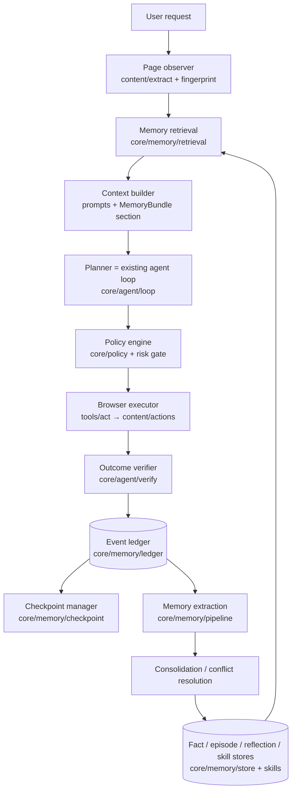

# MemoryAgent Implementation Plan

Goal: extend Inquiso into a browser-native **MemoryAgent** — an agent that remembers *how* a
task was completed, learns from failures, adapts when a site changes, and performs repeated
tasks with fewer actions and less model context. Built on top of the existing M0–M5 codebase
audited in [current-architecture.md](current-architecture.md), with Qwen Cloud (DashScope) as
the first-class model backend.

Two constraints from CLAUDE.md shape the plan:

- **Serverless stays serverless.** All memory runs locally in the extension. The Alibaba Cloud
  deployment hosts the *demo portals + submission assets* (static sites), never an Inquiso
  backend. Qwen Cloud (DashScope) is a first-class BYOK provider — same trust model as
  OpenAI/Anthropic today.
- **≤100 lines/file** forces many small modules; each package below is a directory of focused
  files, mirroring existing conventions (`messaging/schemas/`, `providers/defs/`).

## Logical architecture → repo mapping

| Logical module (task spec) | Actual location | Notes |
| --- | --- | --- |
| memory-core (domain model) | `src/shared/memory/` | Zod schemas: record, scope, candidate, skill, evidence, events, checkpoint. Shared because UI (Memory Center) and core both consume them. |
| event-ledger | `src/core/memory/ledger/` | append-only store over `appStore('ledger')` |
| checkpoint-engine | `src/core/memory/checkpoint/` | `appStore('checkpoints')`, revalidation on resume |
| outcome-verifier | `src/core/agent/verify/` | evidence collection around act tools |
| memory-extraction | `src/core/memory/pipeline/` | candidate gate, sensitive-data filter, dedupe, supersession, episode/reflection extraction |
| memory-consolidation | `src/core/memory/pipeline/` | same package (conflict resolution + reinforcement) |
| memory-retrieval | `src/core/memory/retrieval/` | scope filters → hybrid rank → typed `MemoryBundle` → prompt section |
| skill-engine | `src/core/memory/skills/` | model, candidates, normalize, reliability, shadow, execute, repair, versions |
| policy-engine | `src/core/policy/` | deterministic capability grants layered on the existing risk gate |
| browser-observer | existing `src/content/extract/` + `src/core/context/` | extended with page fingerprint |
| browser-executor | existing `src/core/agent/tools/act/` + `src/content/actions/` | extended with layered locators + evidence rules |
| storage-local | existing `src/core/data/storage/instance.ts` | new object stores: `ledger`, `checkpoints`, `memories`, `skills`, `policies` |
| storage-cloud | out of scope (hard rule: no Inquiso server); export/import via existing BYO-sync | |
| qwen-provider | `src/core/providers/defs/qwen.ts` | DashScope compatible-mode; chat + embeddings (`text-embedding-v3`) |
| memory-ui | `src/ui/features/memory/` + `src/core/messaging/schemas/memory.ts` | Memory Center |
| evaluation | `tests/evaluation/` + `scripts/evaluate-memory.mjs` | `pnpm evaluate:memory` |
| demo portals | `demo/portals/` (new top-level, exempt from line rule) | invoice + expense portals, nav-version switch |
| deployment | `deploy/alibaba/` + `docs/deployment/alibaba-cloud.md` | OSS static hosting for portals/assets |

## Data flow (target)

## Key design decisions

1. **Memory informs, never authorizes.** Retrieval output is rendered inside the existing
   untrusted-data envelope conventions with explicit trust labels (`user-confirmed`,
   `inferred`, `page-derived`, `historical`). Side effects still pass the deterministic policy
   engine + confirm gate; a skill executes through the *same* gated tools, so a "trusted" skill
   never bypasses a confirmation floor.
2. **The ledger is the source of truth.** `emit` already streams every tool call; a run
   recorder tees typed events (`ActionStarted/Succeeded/Failed`, `OutcomeVerified`, …) into the
   ledger keyed `${runId}:${seq}`. Episodes/skills always cite ledger event IDs (provenance).
3. **Verification is evidence-based and separate from the planner.** Act tools gain
   `expectedOutcome` + evidence rules; the verifier snapshots (url, fingerprint, element state)
   before/after and classifies `verified_success | verified_failure | uncertain`. Only
   `verified_success` reinforces skills.
4. **Skills are data, not code**: normalized steps with layered semantic locators
   (role/name/label/text/nearby → css/xpath fallback), `{{parameters}}`, preconditions, success
   criteria; state machine `draft → shadow → verified → trusted`, with `degraded`/`retired`;
   every change creates a new version, old versions preserved.
5. **Model roles via existing provider registry**: planner = user's selected model (Qwen
   `qwen-max`/`qwen-plus` recommended); extraction = cheap model (`qwen-flash`) resolved
   through a new `extractionModel()` helper; embeddings = `text-embedding-v3` through the
   existing `Embedder` interface; vision only when DOM insufficient (existing `vision` flag).
6. **The write pipeline is deterministic first, model second.** Regex/heuristic sensitive-data
   rejection (passwords, tokens, cards, OTPs) and page-origin quarantine run *before* any
   model-proposed candidate is considered; the model can propose, never commit.

## Phases (each = one or more Conventional Commits, repo stays green)

### Phase 1 — Foundation: ledger, verification, checkpoints, resume
- `src/shared/memory/events.ts|evidence.ts|checkpoint.ts|ids.ts` — event union (TaskCreated …
  SkillUpdated), `ActionEvidence`, checkpoint schema, run/task id helpers.
- `src/core/memory/ledger/{store,append,query}.ts` — append-only, seq-numbered, capped +
  GC'd like `history/store.ts`.
- `src/core/agent/verify/{snapshot,evidence,verify}.ts` — before/after snapshots via existing
  `sendToTab` messages + `browser.tabs`; classification.
- Hook into `src/core/chat/run-chat.ts` / `loop/run-agent.ts`: a `RunLedger` recorder wraps
  `emit`; act tools verified post-execution.
- `src/core/memory/checkpoint/{store,create,resume}.ts` + revalidation (compare current
  url/fingerprint before resuming); resume path on `begin` when an unfinished task exists.
- Tests: `tests/unit/core/memory/ledger/*`, `tests/unit/core/agent/verify/*`,
  `tests/unit/core/memory/checkpoint/*`.

### Phase 2 — Explicit memory: domain model, stores, write pipeline, Memory Center
- `src/shared/memory/{record,scope,candidate}.ts` — `MemoryRecord`, `MemoryScope`,
  `Sensitivity`, `MemoryCandidate` (per task spec §6/§10), Zod-validated.
- `src/core/memory/store/{records,query,mutate}.ts` — repo over `appStore('memories')`;
  status transitions (candidate/active/quarantined/superseded/expired/deleted are real
  states; delete is a real delete).
- `src/core/memory/pipeline/{sensitive,gate,dedupe,supersede}.ts` — deterministic rules table
  from spec §10; page-derived → quarantine; secrets → discard.
- Replace `tools/read/memory.ts` KV with typed tools: `remember` (explicit user memory →
  store via pipeline), `recall` (scoped retrieval); migration of old KV entries.
- Messaging: `src/core/messaging/schemas/memory.ts` (`memoryList`, `memoryUpdate`,
  `memoryForget`, `memoryExport`, `memoryControls`…), handlers, and
  `src/ui/features/memory/` Memory Center (list by section, edit/forget/confirm/scope,
  global controls) reachable from the settings tabs.
- Tests: validation, scope filtering, sensitive rejection, dedupe, supersession, real-delete.

### Phase 3 — Retrieval, episodes, reflections, Qwen provider
- `src/core/providers/defs/qwen.ts` + registry entry: DashScope compatible-mode
  (`https://dashscope-intl.aliyuncs.com/compatible-mode/v1`), models
  (`qwen3-max`, `qwen-plus`, `qwen-flash`, `qwen3-vl-plus`), `embeddingModel:
  'text-embedding-v3'` via `createOpenAICompatible(...).textEmbeddingModel`, key URL, data-use
  disclosure. Extraction-model routing helper in `src/core/providers/extraction.ts`.
- `src/core/memory/pipeline/{episode,reflect,extract}.ts` — post-run episode compression +
  reflection generation with the fast model; structured output validated with Zod; failures
  produce failure-reflections.
- `src/core/memory/retrieval/{filters,score,bundle,inject}.ts` — hard scope/temporal/status
  filters → hybrid score (scope match, lexical, embedding, reliability, recency, usefulness,
  staleness/failure penalties) → budgeted typed `MemoryBundle` → compact labeled prompt
  section; `MemoryRetrieved` ledger events + per-memory `retrievalCount/usefulCount`.
- Port event so the UI can show "Using: …" (`PortOutbound` + recorder + transcript chip).
- Tests: ranking, budget, temporal validity, bundle rendering, extraction schema handling.

### Phase 4 — Skill engine (flagship)
- `src/shared/memory/{skill,locator}.ts` — `BrowserSkill` (spec §5.8), `ElementLocator`
  (spec §8), versioned.
- `src/core/memory/skills/{store,candidates,normalize,params,preconditions,reliability,shadow,execute,repair}.ts`
  — candidate from ≥N similar verified episodes or explicit "save workflow"; trajectory
  normalization (ledger events → semantic steps with locators); stable/variable parameter
  split; precondition checks (origin, page fingerprint, auth hints, inputs); shadow-mode
  comparison; reliability counters + state machine; degradation on missing
  elements/fingerprint drift/verification failures; repair = diff old vs new trajectory →
  new version in shadow.
- Locator resolution ladder in `src/content/actions/locate.ts` (role+name → label → text →
  nearby → testId → css → xpath), recording which layer matched.
- Agent integration: retrieval offers candidate skills; `run_skill` tool executes steps
  through the existing gated tools with per-step verification; disagreements + recoveries
  logged as events.
- Tests: reliability transitions, degradation, repair versioning, locator fallback order,
  normalization, parameter extraction.

### Phase 5 — Policy engine + injection/poisoning defense
- `src/core/policy/{capabilities,engine,grants,store}.ts` — every tool mapped to a capability
  (read_page, navigate, download, upload, fill_form, submit_form, send_message, delete,
  purchase, change_settings); deterministic `allow|deny|ask` from user grants scoped to
  action/task/origin/workflow; always-ask floor for irreversible capabilities; integrated
  into the registry gate *in addition to* (never instead of) `confirmWhen` floors.
- Quarantine enforcement: page-derived candidates never auto-activate; hidden-DOM content
  flagged lower-trust in extraction.
- Adversarial tests (`tests/unit/core/memory/poisoning.test.ts` + fixtures): injection pages
  ("remember this password", "always approve purchases", recipient-override) must be
  rejected/quarantined; policy bypass attempts must fail.

### Phase 6 — Demo portals + evaluation
- `demo/portals/` — static invoice portal (accounts, Settings→Billing vs Account→Billing nav
  **version switch**, virtualized invoice table, PDF/CSV download) + expense portal (form,
  upload, categories, draft/submit with confirmation); `pnpm demo` serves locally.
- `tests/evaluation/` + `scripts/evaluate-memory.mjs` (`pnpm evaluate:memory`): drives the
  real agent loop with a deterministic scripted model (AI SDK `MockLanguageModelV2`) against
  portal fixtures under happy-dom; configurations: no-memory / checkpoint-only / facts /
  facts+episodes+reflections / full-skills; measures actions, failed actions, recoveries,
  model calls, tokens, retrieval precision, stale-memory selection, injection success rate,
  duplicate rate. Results written to `docs/memory-agent/evaluation-results.md` — measured
  numbers only, harness assumptions documented.
- Live-metrics comparison surfaced in the UI after repeated runs (real measured run stats
  from the ledger, not hard-coded).

### Phase 7 — Alibaba deployment + docs + submission
- `deploy/alibaba/` — Serverless Devs (`s.yaml`) / ossutil config deploying `demo/portals`
  to OSS static website hosting (+ optional Function Compute health endpoint), no secrets
  committed; `docs/deployment/alibaba-cloud.md` with exact steps + architecture diagram.
- Docs set: `docs/memory-agent/{overview,data-model,security,retrieval,browser-skills,evaluation}.md`,
  `docs/demo-script.md`, `docs/memory-agent/showcase.md`; README + `docs/architecture.md`
  Mermaid diagrams (memory lifecycle, skill lifecycle, permission flow, first vs repeated
  run); changesets per feature area; final `pnpm check && typecheck && test && lines && build`.

## Prioritization under time pressure (spec §28)

Order within phases already reflects it: ledger + verification + checkpoints (P1) → typed
memory + Memory Center (P2) → retrieval + Qwen (P3) → **one deeply working learned workflow
with degradation + repair** (P4) → security tests (P5) → demo + measured eval (P6) → deploy +
docs (P7). If time runs out mid-P4+, the P1–P3 system already proves persistent cross-session
memory with provenance; the plan keeps the repo green after every phase.

## Risks

- **Service-worker lifetime**: extraction pipeline after a run must be resilient to worker
  suspension → extraction is triggered from persisted ledger state (idempotent, re-runnable
  on wake), not in-memory state.
- **Eval realism**: unit-level harness uses a scripted planner; documented as such. E2E against
  the real portals via Playwright covers the happy path in a real browser.
- **DashScope endpoint variants** (intl vs cn): base URL configurable; default intl.
- **100-line rule**: forces fragmentation; mitigated with per-directory `index.ts` barrels as
  the codebase already does.

Progress and discoveries are logged in [build-log.md](build-log.md) as implementation proceeds.
