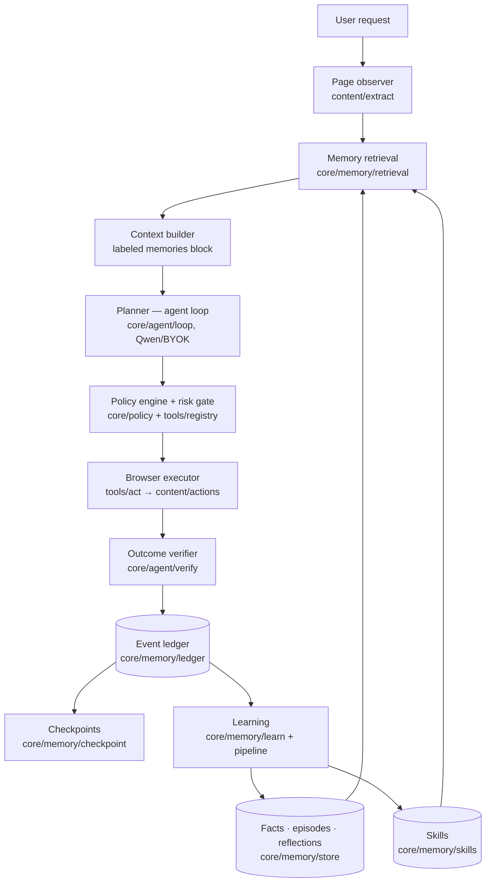
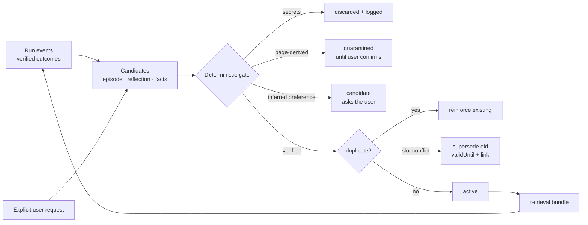
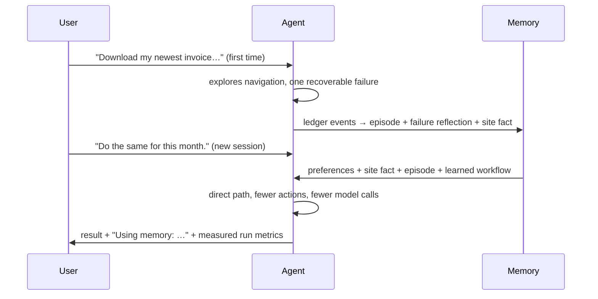

# MemoryAgent Overview

> Existing browser agents can complete a task. Inquiso **remembers how** the task was
> completed, learns from failures, adapts when a website changes, and performs the next task
> more accurately with fewer actions and less model context.

This document is the map; details live in [data-model.md](data-model.md),
[retrieval.md](retrieval.md), [browser-skills.md](browser-skills.md),
[security.md](security.md), and [evaluation.md](evaluation.md). What was built when (and what
was pre-existing Inquiso) is recorded in [build-log.md](build-log.md) and
[current-architecture.md](current-architecture.md).

## Principles (non-negotiable)

1. **Memory is not chat history.** Durable memories are structured, scoped, deduplicated,
   inspectable records with provenance — never raw transcripts or DOM dumps.
2. **Memory informs, never authorizes.** Side effects pass the deterministic policy engine +
   confirmation gate every time; no memory, skill, or page content can create a permission.
3. **Page content is untrusted.** Anything website-supplied enters memory quarantined at best.
4. **Success must be verified.** Only evidence-backed outcomes (URL change, element state,
   download, …) reinforce memory or skills; *uncertain is never success*.
5. **Local-first.** Every store is IndexedDB in the browser; inspect, edit, forget, export,
   and disable it all in the Memory Center. Nothing syncs anywhere.

## Architecture

## Memory lifecycle

## First run vs repeated run

Measured effect (harness, see [evaluation-results.md](evaluation-results.md)): 6→3→3 actions
and 3→2→1 planning calls across three sessions; after a site change, 9 actions with 4
failures (recovered) degrades and repairs the workflow back to 3 actions with 0 failures.

## What lives where

| Concern | Package |
| --- | --- |
| Typed schemas (records, events, skills, checkpoints) | `src/shared/memory/` |
| Event ledger + run metrics | `src/core/memory/ledger/` |
| Checkpoints + resume | `src/core/memory/checkpoint/` |
| Write pipeline (gate, dedupe, supersede, episodes, reflections, extraction) | `src/core/memory/pipeline/` |
| Retrieval (filters, hybrid ranking, bundle, prompt injection) | `src/core/memory/retrieval/` |
| Skill engine (learn, shadow, execute, degrade, repair) | `src/core/memory/skills/` |
| Outcome verifier | `src/core/agent/verify/` |
| Policy engine | `src/core/policy/` |
| Providers + fast-model routing | `src/core/providers/`, `extraction.ts` |
| Memory Center UI | `src/ui/features/memory/` |
| Evaluation harness | `tests/evaluation/` |
